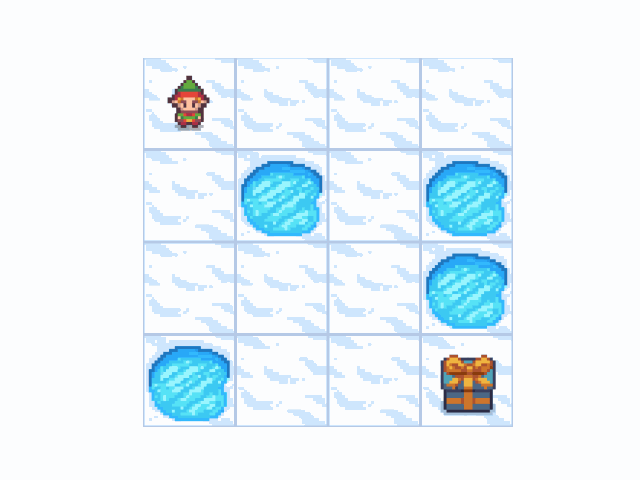
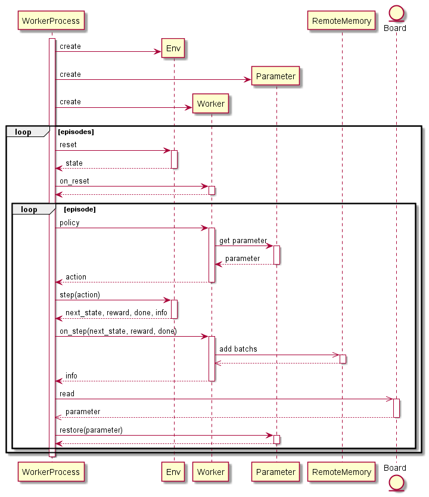
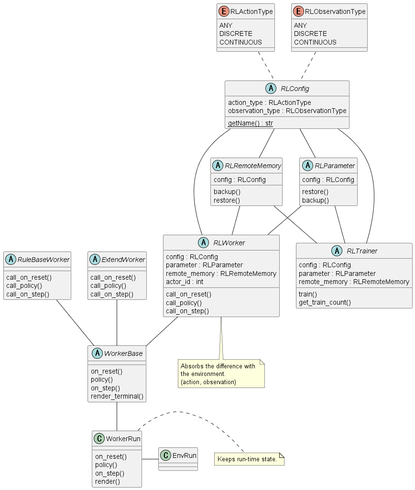

[](https://github.com/pocokhc/simple_distributed_rl/releases/latest)

# Simple Distributed Reinforcement Learning (シンプルな分散強化学習)

シンプルな分散強化学習フレームワークを目指して作成しました。  
どちらかというと学習用フレームワークに近いかもしれません。  
以下の特徴があります。  

+ カスタマイズ可能な環境クラスの提供
+ カスタマイズ可能な強化学習アルゴリズムクラスの提供
+ 環境とアルゴリズム間のインタフェースの自動調整
+ 分散強化学習のサポート
+ 有名な強化学習アルゴリズムの提供
+ （新しいアルゴリズムへの対応）

また本フレームワークの解説は[Qiita記事](https://qiita.com/pocokhc/items/a2f1ba993c79fdbd4b4d)に記載しております。

# Download/Install

・**git clone install**

git clone してインストールする方法です。

``` bash
git clone https://github.com/pocokhc/simple_distributed_rl.git
cd simple_distributed_rl
pip install .

# (option) packages to use in plot/animation
pip install opencv-python pillow matplotlib pandas pygame

# (option) use gym environment
pip install gym pygame

# --- run sample
python examples/minimum_runner.py
```

・ **Direct install**

直接インストールする方法です。
フレームワーク側で作成した環境とアルゴリズムはついてこないので必要に応じてダウンロードしてください
（"envs" 配下に環境、"algorithms" 配下にアルゴリズムがあります）

``` bash
pip install git+https://github.com/pocokhc/simple_distributed_rl

# --- run sample
# wget で grid(env) と ql(algorithm) と実行用ファイルを download
mkdir envs algorithms examples
wget https://raw.githubusercontent.com/pocokhc/simple_distributed_rl/main/envs/grid.py -O envs/grid.py
wget https://raw.githubusercontent.com/pocokhc/simple_distributed_rl/main/algorithms/ql.py -O algorithms/ql.py
wget https://raw.githubusercontent.com/pocokhc/simple_distributed_rl/main/examples/minimum_runner.py -O examples/minimum_runner.py
# run
python examples/minimum_runner.py
```

・**No install(Download only)**

srlに実行パスが通っていれば install しなくても使えます。

``` bash
# Download srl files
git clone https://github.com/pocokhc/simple_distributed_rl.git
```

``` python
# srl までのパスを通してimportする例
import os
import sys

assert os.path.isdir("./simple_distributed_rl/srl/")  # srlがここにある想定です
sys.path.insert(0, "./simple_distributed_rl/")

import srl
```

## Using library

+ numpy

### Option library

+ アルゴリズムによっては使用
  + tensorflow
  + tensorflow-addons
+ 描画関係で使用
  + matplotlib
  + pillow
  + opencv-python
  + pandas
  + pygame
+ gym の環境を使う場合に必要
  + gym
  + pygame
+ cpu/gpu 情報を記録したい場合に必要
  + psutil
  + pynvml

# Usage

+ **Basic run of study**

``` python
import numpy as np
import srl
from srl import runner

# --- env & algorithm load
from envs import grid  # isort: skip # noqa F401
from algorithms import ql  # isort: skip


def main():
    # config
    env_config = srl.EnvConfig("Grid")
    rl_config = ql.Config()
    config = runner.Config(env_config, rl_config)

    # train
    parameter, remote_memory, history = runner.train(config, timeout=20)
    
    # evaluate
    rewards = runner.evaluate(config, parameter, max_episodes=100)
    print(f"Average reward for 100 episodes: {np.mean(rewards)}")


if __name__ == "__main__":
    main()

```

+ **Commonly run Example**

``` python
import numpy as np
import srl
from srl import runner

# --- use env & algorithm load
# (Run "pip install gym pygame" to use the gym environment)
import gym  # isort: skip # noqa F401
from algorithms import ql  # isort: skip


def main():

    # --- set config
    #   Configのパラメータは、引数補完または元コードを参照してください。
    #   For the parameters of Config, refer to the argument completion or the original code.
    env_config = srl.EnvConfig("FrozenLake-v1")
    rl_config = ql.Config()
    config = runner.Config(env_config, rl_config)

    # load parameter (Loads the file if it exists)
    parameter_path = "_params.dat"
    rl_config.parameter_path = parameter_path

    # --- train
    if False:
        # sequence training
        parameter, remote_memory, history = runner.train(config, timeout=60)
    else:
        # distributed training
        mp_config = runner.MpConfig(actor_num=2)  # distributed config
        parameter, remote_memory, history = runner.mp_train(config, mp_config, timeout=60)
    
    # save parameter
    parameter.save(parameter_path)

    # --- training progress data
    logs = history.get_logs()  # get raw data

    # plot
    # (Run "pip install matplotlib pandas" to use the history.plot())
    history.plot()

    # (Run "pip install pandas" to use the history.get_df())
    df_logs = history.get_df()

    # --- evaluate
    rewards = runner.evaluate(config, parameter, max_episodes=100)
    print(f"Average reward for 100 episodes: {np.mean(rewards)}")

    # rendering (You can watch the progress of 1 episode)
    runner.render(config, parameter)

    # animation
    # (Run "pip install opencv-python pillow matplotlib pygame" to use the animation)
    render = runner.animation(config, parameter)
    render.create_anime(interval=1000 / 3).save("_FrozenLake.gif")


if __name__ == "__main__":
    main()

```



※実行するとログ保存のために `./tmp/DATE_EnvName_AlgorithmName/` ディレクトリが作成ます。  
　削除して問題ありません。  
　作成をやめたい場合は `train` の引数に `enable_file_logger=False` を追加してください。  
　ただ、その場合 `history` は使えなくなります。  

# Customize

オリジナル環境とアルゴリズムの作成例は以下のファイルを参考にしてください。

examples/custom_env.ipynb  
examples/custom_rl.ipynb  

# Algorithms

## ModelFree

### ValueBase

|Algorithm |Observation|Action  |Frameworks|ProgressRate||
|----------|-----------|--------|----------|----|---|
|QL        |Discrete   |Discrete|          |100%|Basic Q Learning|
|DQN       |Continuous |Discrete|Tensorflow|100%||
|C51       |Continuous |Discrete|Tensorflow| 99%|CategoricalDQN|
|Rainbow   |Continuous |Discrete|Tensorflow,tensorflow_addons|100%||
|R2D2      |Continuous |Discrete|Tensorflow|100%||
|Agent57   |Continuous |Discrete|Tensorflow|100%||

### PolicyBase/ActorCritic

|Algorithm              |Observation|Action    |Frameworks|ProgressRate|
|-----------------------|-----------|----------|----------|----|
|VanillaPolicy          |Discrete   |Both      ||100%|
|A3C/A2C                |           |          ||  0%|
|TRPO                   |Continuous |          ||   -|
|PPO                    |Continuous |          ||  0%|
|DDPG/TD3               |Continuous |Continuous|Tensorflow|100%|
|SAC                    |Continuous |Continuous|Tensorflow|100%|

## AlphaSeries

|Algorithm  |Observation|Action  |Frameworks|ProgressRate||
|-----------|-----------|--------|----------|----|---|
|MCTS       |Discrete   |Discrete|          |100%|MDP base|
|AlphaZero  |Image      |Discrete|Tensorflow|100%|MDP base|
|MuZero     |Image      |Discrete|Tensorflow|100%|MDP base|
|StochasticMuZero|Image |Discrete|Tensorflow|100%|MDP base|

## ModelBase

|Algorithm  |Observation|Action     |Frameworks|ProgressRate|
|-----------|-----------|-----------|----------|----|
|DynaQ      |Discrete   |Discrete   | 10%|

### WorldModels

|Algorithm  |Observation|Action     |Frameworks|ProgressRate|
|-----------|-----------|-----------|----------|----|
|WorldModels|Continuous |Discrete   |Tensorflow|100%|
|PlaNet     |           |           ||  0%|
|Dreamer    |           |           ||  0%|
|DreamerV2  |           |           ||  0%|

## Offline

|Algorithm  |Observation|Action     |Frameworks|ProgressRate|
|-----------|-----------|-----------|----------|----|
|CQL        |Discrete   |Discrete   ||  0%|

## その他(Original)

|Algorithm    |Observation|Action  |Type     |Frameworks|ProgressRate|
|-------------|-----------|--------|---------|----------|----|
|QL_agent57   |Discrete   |Discrete|ValueBase|          | 80%|QL + Agent57|
|Agent57_light|Continuous |Discrete|ValueBase|Tensorflow|100%|Agent57 - (LSTM,MultiStep)|
|SearchDynaQ  |Discrete   |Discrete|ModelBase/ValueBase|| 80%||

# Diagrams

## Overview

+ sequence flow


+ distributed flow


+ multiplay flow


## PlayFlow


## Distribute flow

+ main


+ Trainer


+ Workers



## Class diagram



![class_env.png)

# Interface

|   |           |          |Type|
|---|-----------|----------|------|
|env|action     |          |Space|
|env|observation|          |Space|
|rl |action     |Discrete  |int|
|rl |action     |Continuous|list[float]|
|rl |observation|Discrete  |np.ndarray(dtype=int)|
|rl |observation|Continuous|np.ndarray(dtype=float)|

+ Space(srl.base.env.spaces)

|class               |Type       |
|--------------------|-----------|
|DiscreteSpace       |int        |
|ArrayDiscreteSpace  |list[int]  |
|ContinuousSpace     |float      |
|ArrayContinuousSpace|list[float]|
|BoxSpace            |np.ndarray |

# Development environment / Operation check environment

+ windows10
  + CPUx1: Core i7-8700 3.2GHz
  + GPUx1: NVIDIA GeForce GTX 1060 3GB
  + memory 48GB
+ Python(3.7.9, 3.9.13)
  + numpy: 1.22.4
  + tensorflow: 2.9.1
  + tensorflow-addons: 0.17.1
  + tensorflow_probability: 0.17.0
  + matplotlib: 3.5.2
  + pillow: 9.1.1
  + pandas: 1.4.2
  + opencv-python: 4.6.0.66
  + gym: 0.24.1
  + pygame: 2.1.2
  + psutil: 5.9.1
  + pynvml: 11.4.1
